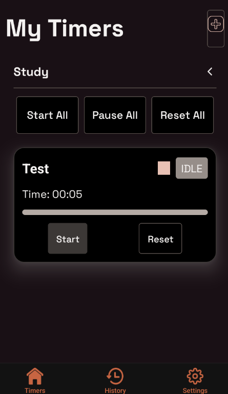
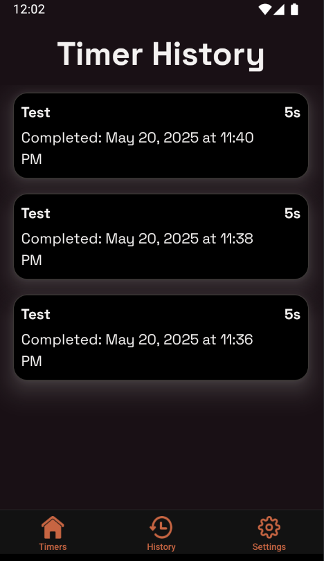
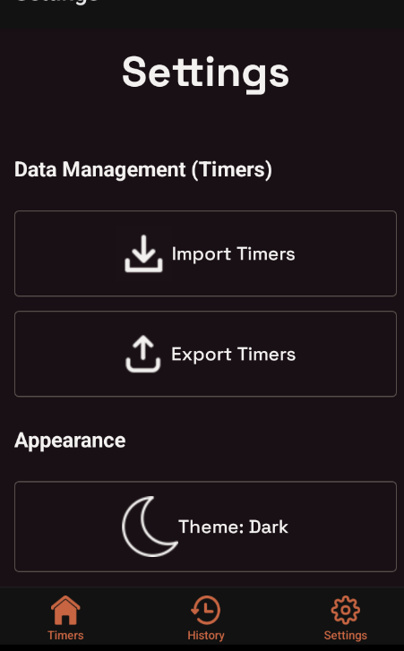

# Welcome to your Timer App!

> A powerful and customizable React Native timer application.

This timer app lets users create and manage multiple timers efficiently. You can group timers, export and import them, and view timer history. Additionally, the app includes a **theme switcher**, allowing users to toggle between **dark mode** and **light mode** for a personalized experience.







## Getting Started

```bash  
npm install  
npm run start  
npm run android // To run android
```  

To make things work on your local simulator or phone, first, run the `eas build` command:

```bash  
npm run build:ios:sim # Build for iOS simulator  
npm run build:ios:dev # Build for iOS device  
npm run build:ios:prod # Build for iOS device  
```  

## Timer Features

This app is designed to help users effectively **manage multiple timers** with ease. It comes packed with several features:

- **Create & Use Multiple Timers** – Set up individual timers for different tasks.
- **Timer Groups** – Organize timers into categories for better management.
- **Export & Import Timers** – Save and load timers across different devices.
- **Timer History** – Keep track of past timers and their usage.
- **Dark & Light Mode** – Switch between themes for comfortable viewing.
